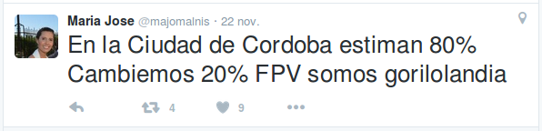

```{r, echo=FALSE, message=FALSE, warning = FALSE}
library(pander)
library(ggplot2)
theme_set(theme_grey()) # set default theme for plots
library(dplyr)
library(reshape2)
library(knitr)
opts_chunk$set(echo=FALSE, message=FALSE, warning = FALSE, results='hide')
setwd("~/Repos/pdelboca/ballotage-2015")
```

```{r, echo=FALSE, cache=TRUE}
# Obtener los datos del Servidor
fileURL <- 'https://t.co/IaM2KxCemf'
dataFile <- './data/mesas_final_balotaje_2015.csv'
if(!file.exists('./data')){
  dir.create('./data')
}
if(!file.exists(dataFile)){
  download.file(fileURL, destfile=dataFile, method="curl")
}

df <- read.csv('./data/mesas_final_balotaje_2015.csv')
prov <- data.frame(id = c(1:24), provincia=c("CABA","Buenos Aires","Catamarca","Cordoba","Corrientes","Chaco","Chubut","Entre Rios", "Formosa","Jujuy","La Pampa","La Rioja","Mendoza","Misiones","Neuquen","Rio Negro","Salta","San Juan", "San Luis", "Santa Cruz", "Santa Fe", "Santiago del Estero", "Tucuman", "Tierra del Fuego"))
colnames(df)[1] <- "provincia_id"
df <- merge(prov, df, by.x = "id", by.y = "provincia_id")
df$id <- NULL
```

```{r}
# Funciones para graficar (DRY!)
graficaHistogramaComparativo <- function(provincias){

dfTemp <- subset(df, provincia %in% provincias)

col <- c("provincia", "porc_cambiemos", "porc_fpv")
porcTemp <- melt(dfTemp[,col], id.vars = "provincia")
ggplot(porcTemp,aes(x=value)) +
  geom_histogram(data=subset(porcTemp,variable == 'porc_cambiemos'),
                 fill = "red", alpha=0.7,
                 binwidth=1) +
  geom_histogram(data=subset(porcTemp,variable == 'porc_fpv'),
                 fill = "blue", alpha=0.7,
                 binwidth=1) +
  ggtitle("Distribución de Porcentaje de Votos por Mesa.") +
  facet_wrap(~provincia, nrow = 5,scales = "free_y") +
  xlab("Porcentaje Obtenido por el Partido en una mesa\n Rojo = Cambiemos / Azul = FPV") +
  ylab("Cantidad de Mesas")
}
```

### Introducción
Este post nace de mi curiosidad innata y de un comentario que se dió luego del Ballotage 2015:


Haciendo alusión a que el presidente electo obtuvo alrededor del 70% de los votos, mientras que el otro candidato el restante 30%. Esto significa que en la mayoría de las mesas, el partido cambiemos debió obtener más del 70% de los votos. Efectivamente, el siguiente histograma lo demuestra.

```{r}
cbaCambiemos <- df[df$provincia == "Cordoba", c("porc_cambiemos")]
ggplot(as.data.frame(cbaCambiemos), aes(x=cbaCambiemos)) + 
  geom_histogram(binwidth=1, fill="red", alpha=0.7)+
  geom_vline(xintercept=70) + 
  ggtitle("Histograma de Porcentaje de Votos \n en cada mesa para el partido Cambiemos\n en Córdoba") +
  xlab("Porcentaje obtenido en la mesa.")
```

Algunos incluso se tomaron con humor la inclinación política de la provincia:



El FPV quedó desde lejos mirando el promedio de votos que obtuvo cambiemos. __Debería ser el mismo gráfico pero espejado, dado que en las mesas donde Cambiemos sacó 70%, el FPV sacó 30%__:

```{r}
cbaFPV <- df[df$provincia == "Cordoba", c("porc_fpv")]
ggplot(as.data.frame(cbaFPV), aes(x=cbaFPV)) + 
  geom_histogram(binwidth=1,  fill="blue", alpha=0.7)+
  geom_vline(xintercept=70) + 
  ggtitle("Histograma de Porcentaje de Votos \n en cada mesa para el partido Cambiemos\n en Córdoba") +
  xlab("Porcentaje obtenido en la mesa.")
```

Ambos juntos:

```{r}
graficaHistogramaComparativo("Cordoba")
```

__¿Cómo se interpreta a alto nivel ese gráfico?__ A mayor cantidad de mesas con mucha cantidad de votos para un mismo partido y, por ende, menor cantidad de votos para el otro partido, más separadas las curvas. Cabe recordar que donde Cambiemos sacó 70%, el FPV sacó 30%, por ende, hay igual cantidad de mesas para ambos partidos en porcentajes complementarios.

En contraparitda, si las curvas se solaparan, significaría que los candidatos tuvieron una elección muy reñida en dicha provincia. Por ejemplo, en La Pampa, el FPV sacó 49,09% y Cambiemos 50,91%. El Gráfico es el siguiente:

```{r}
graficaHistogramaComparativo("La Pampa")
```

## Nuevas Preguntas
De estos datos me resultó curioso preguntar. __¿En cuántas mesas de la Argentina los candidatos se impusieron casi por unanimidad?__ Definiendo unanimidad como obtener en una mesa más del 90% de los votos.

```{r, message=FALSE, error=FALSE}
porcLong <- melt(df[df$votantes > 1, c("porc_cambiemos","porc_fpv")])
porcLong <- group_by(porcLong, variable, value) %>%
        summarize(cant_mesas=n())
levels(porcLong$variable) <- c("Cambiemos", "FPV")

mesasUnanimes = subset(porcLong, value %in% 90:100)
ggplot(mesasUnanimes, aes(x=variable, y=cant_mesas, fill=variable)) + 
  geom_bar(stat = "identity") +
  facet_grid(. ~ value) +
  ggtitle("Cantidad de mesas con 90% a 100% de votos \n a un mismo partido") +
  theme(axis.text.x = element_text(angle = 45, hjust = 1)) + 
  xlab("Partido") +
  ylab("Cantidad de Mesas")
```

El total de mesas es `r sum(mesasUnanimes$cant_mesas)` de un total de `r nrow(df)`, es decir un `r round(sum(mesasUnanimes$cant_mesas)/nrow(df)*100,1)`% de las mesas.

¿Y en qué provincias están estas mesas?
```{r, message=FALSE, error=FALSE}
sel <- c("provincia", "porc_cambiemos", "porc_fpv")

porcProv <- melt(df[,sel], id.vars = "provincia") %>%
  filter(value>85) %>%
  group_by(provincia, variable) %>%
  summarise(cant_mesas = n()) %>%
  arrange(variable)

# Code to order ggplot bars... WTF ggplot!
order <- group_by(porcProv, provincia) %>% 
  summarise(cant = sum(cant_mesas)) %>% 
  arrange(cant)
porcProv$provincia <- factor(porcProv$provincia, levels = order$provincia)

ggplot(porcProv, aes(provincia,cant_mesas, fill=variable)) +
  geom_bar(stat = 'identity')  + 
  coord_flip() + 
  ggtitle("Mesas con 90% a 100% de Votantes a un mismo partido \n por provincia.") +
  ylab("Cantidad de Mesas") + 
  xlab("Provincia")
```

Tomemos las primeras 5 Provincias. ¿Cómo fue la distribución de votos en general? Al ser provincias con una tendencia tan marcada hacia un partido político, se debería observar dos histogramas bien dispares para cada una de ellas.

```{r}
provincias <- c("Tucuman", "CABA", "Cordoba", "Buenos Aires", "Santiago del Estero", "Formosa")
graficaHistogramaComparativo(provincias)
```

```{r}
#### Mesas donde CAMBIEMOS sacó más votos
columnas <- c("provincia", "FPV", "CAMBIEMOS", "electores", "url")
head(df[order(df$CAMBIEMOS, decreasing = TRUE), columnas], 10)
```

```{r}
#### Mesas donde CAMBIEMOS sacó el 100% de los votos
df[df$porc_cambiemos == 100, columnas]
```

```{r}
#### Mesas donde el FPV sacó más votos
head(df[order(df$FPV, decreasing = TRUE), columnas], 10)
```

```{r}
#### Mesas donde FPV sacó el 100% de los votos
df[df$porc_fpv == 100, columnas]
```

## Conclusión

En los gráficos se pueden observar cómo las distintas provincias están muy inclinadas para distintos candidatos. ¿Se podría concluir que, independientemente del nivel de riqueza en cada provincia, el electorado se inclina de la misma manera para con su candidato predilecto? Es decir, que las provincias más "ricas" votan a los gobiernos más neoliberales/derecha y las provincias más "pobres" a gobiernos más de izquierda/populares.

Se suele decir que en las provincias/ciudades donde hay mucha inclinación hacia un candidato hay "voto comprado". Incluso si es una zona pobre del país se opina muchas veces que no es un voto "calificado". ¿Es viable afirmarlo sabiendo que en las provincias más acaudaladas hubo también una fuerte inclinación para con los gobiernos más neoliberales/derecha? ¿Si en Santiago del Estero hay voto comprado porque en las mesas hay 90% a un candidato populista, lo hay también en Córdoba donde hay un 90% a un candidato neoliberal?

No es el objetivo del artículo sacar conclusiones sociologicas/políticas, sin dudas es tema de debate. Desde __OpenDataCordoba__ nos interesa demostrar como una política pública y abierta de datos puede fomentar el análisis y el involucramiento del ciudadano en la vida política del país.

Link al repositorio con el código del análisis: [link](https://github.com/pdelboca/ballotage-2015)